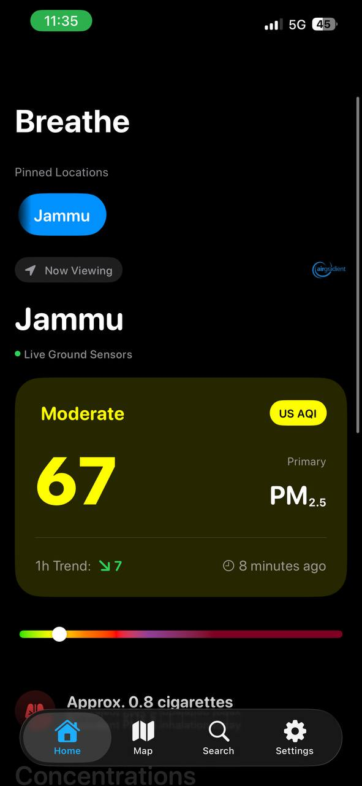
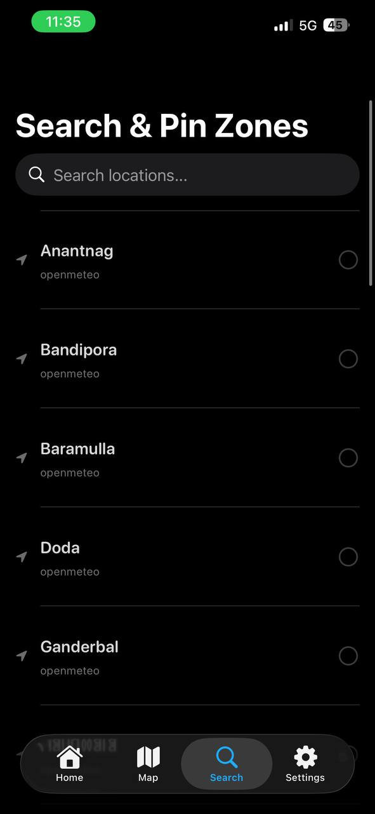
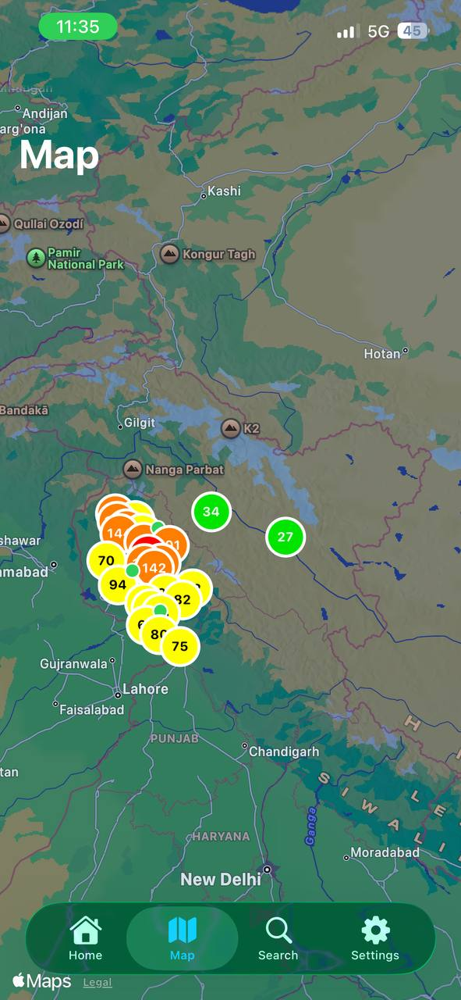
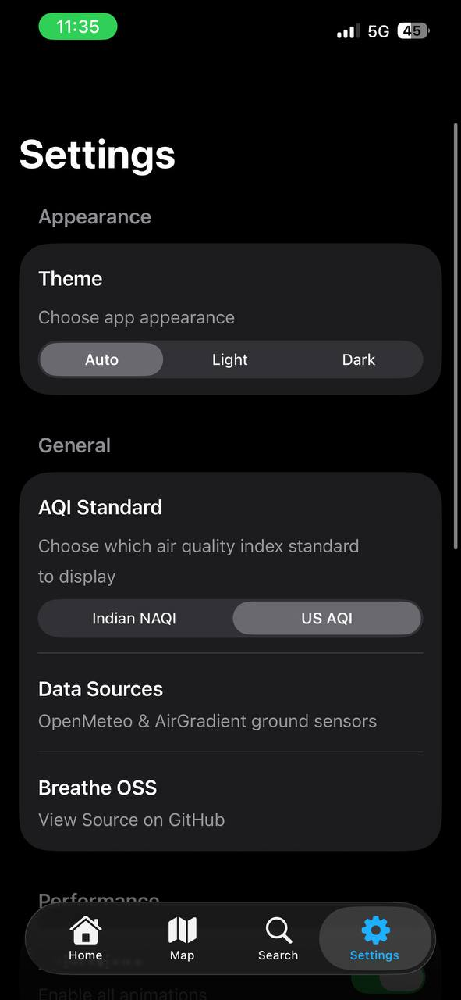

# Breathe (iOS)

> _"Breathe, breathe in the air. Don't be afraid to care."_ - **Pink Floyd**, _The Dark Side of the Moon_

<p align="center">
  
</p>

<p align="center">
  
  
  
  
</p>

> **Note:** This repository is specifically for the **iOS** version of Breathe. If you are looking for the original Android version, please visit the [Breathe (Android) repository](https://github.com/breathe-OSS/breathe).

**Breathe** is a modern iOS application designed to monitor real-time Air Quality Index (AQI) levels across Jammu & Kashmir. Built with **Swift** and **SwiftUI**, it provides a clean, fluid interface to track pollution levels using the Indian National Air Quality Index (NAQI) standards.

- Check the [**breathe api**](https://github.com/breathe-OSS/api?tab=readme-ov-file#how-the-aqi-is-calculated) repo to know how the AQI is calculated.

---

## Features

- **Modern iOS Design**
- **Dark Mode Support**
- **Fluid Animations and interactive UI**
- **AQI Spectrum**
- **Real-time Monitoring**
- **Detailed AQI Breakdown**
- **Map View with Data Overlay**
- **24-Hour Graph of AQI Data**
- **Widget Support**

## Tech Stack

- **Language:** Swift
- **UI Framework:** SwiftUI
- **Architecture:** MVVM (Model-View-ViewModel)
- **Networking:** URLSession
- **Concurrency:** Swift Concurrency (async/await)

## Structure

The project follows a modularized iOS app structure.

```ios/
├── Breathe/
│   ├── App/                   # Application Entry Point
│   │   └── BreatheApp.swift
│   ├── Models/                # Data Models
│   │   └── Models.swift
│   ├── Networking/            # API Service
│   │   └── BreatheAPI.swift
│   ├── ViewModel/             # ViewModels
│   │   └── BreatheViewModel.swift
│   └── Views/                 # UI Components and Screens
│       ├── GraphView.swift
│       ├── HomeView.swift
│       ├── MainTabView.swift
│       ├── MapView.swift
│       ├── SearchView.swift
│       └── SettingsView.swift
└── BreatheWidget/             # iOS Widget Extension
    ├── AppIntent.swift
    ├── BreatheWidget.swift
    └── BreatheWidgetBundle.swift
```

## Build and deploy locally

### Prerequisites

- Xcode 15 or newer.
- A running instance of the **Breathe Backend** (Python/FastAPI).

### Installation

1. **Clone the repository:**
   `git clone https://github.com/breathe-OSS/breathe-ios && cd breathe-ios`

2. **Open in Xcode:**
   Open `Breathe.xcodeproj` or `Breathe.xcworkspace`.

3. **Configure the API Endpoint:**
   - Update the API URL in `Breathe/Networking/BreatheAPI.swift` to point to your backend server.

4. **Build and Run:**
   - Select your target device or simulator in Xcode and hit **Cmd + R** (Run).

## AQI Data Providers

### Why this exists

Publicly available AQI data for the Jammu & Kashmir region is currently unreliable. Most standardized sources rely on sparse sensor networks or algorithmic modeling that does not accurately reflect ground-level realities. This results in widely varying values across different platforms. **Google**, for example, shows values that are insanely **low**, but they are usually off by a huge margin.

**Breathe** aims to solve this by strictly curating sources and building a ground-truth network.

The method that we use to convert the raw data in our API **(please do read the documentation)** was laid out by scanning past concentration trends from 2025-2022 of the J&K regions.

## Current Data Sources

### Open-Meteo

Used for all pollutant values for **most regions** in Jammu & Kashmir (excluding Srinagar, Jammu and Rajouri).
Open-Meteo's satellite-based air quality model provides stable and consistent values that generally fall within the expected range of nearby ground measurements.

- Air quality & pollutant data: [Open-Meteo Air Quality API](https://open-meteo.com/en/docs/air-quality-api)
- Weather forecasts & historical data: [Open-Meteo](https://open-meteo.com)

### AirGradient

Used for the **Srinagar**, **Jammu** and **Rajouri** regions, where the sensors are deployed in real time.

- Their website: [AirGradient](https://www.airgradient.com/)

This provides accurate values of PM10 and PM2.5. Other values are fetched from Open-Meteo (like O₃ and NO₂)

## Call for Contributors (Hardware)

The limitations of our current project is that we do not have ground sensors in every region and are mostly relying on satellite data, so the data is **not 100%** accurate.

We are actively working to deploy custom physical sensors to improve data density in Jammu. If you are interested in hosting a sensor node, please contact us at: [contact@breatheoss.app](mailto:contact@breatheoss.app)

We have deployed two **AirGradient** sensors in Jammu, Srinagar and Rajouri which provide an accurate measurement of PM10 and PM2.5 values. We are working to deploy them in three other regions.

## Credits & Developers

This project is fully Free & Open Source Software (FOSS).

1. [sidharthify](https://github.com/sidharthify) (Lead Dev)
2. [Flashwreck](https://github.com/Flashwreck) (Lead dev and devops maintainer)
3. [SleeperOfSaturn](https://github.com/SleeperOfSaturn) (iOS app co-lead)
4. [Lostless1907](https://github.com/Lostless1907) (Contributor and developer)
5. [suveshmoza](https://github.com/suveshmoza) (Contributor and developer)
6. [empirea9](https://github.com/empirea9) (Contributor)